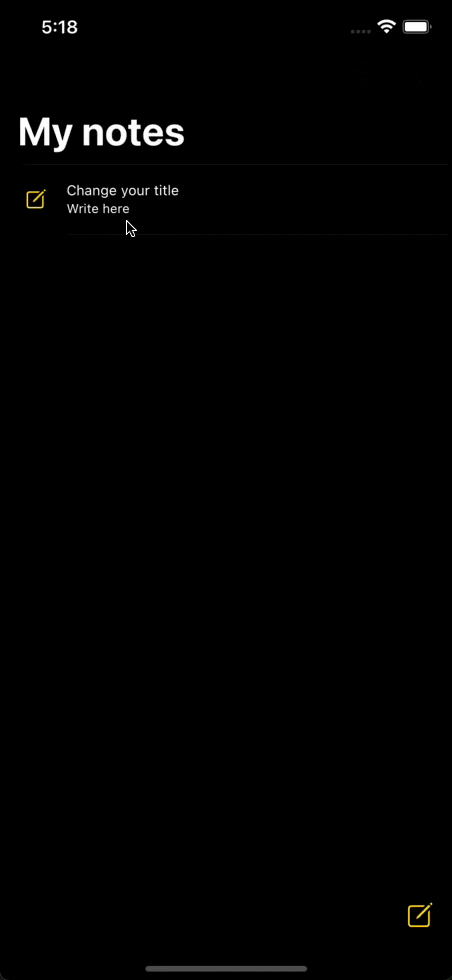
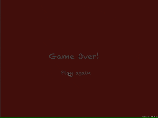
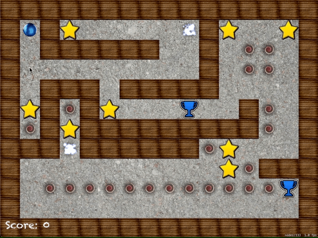
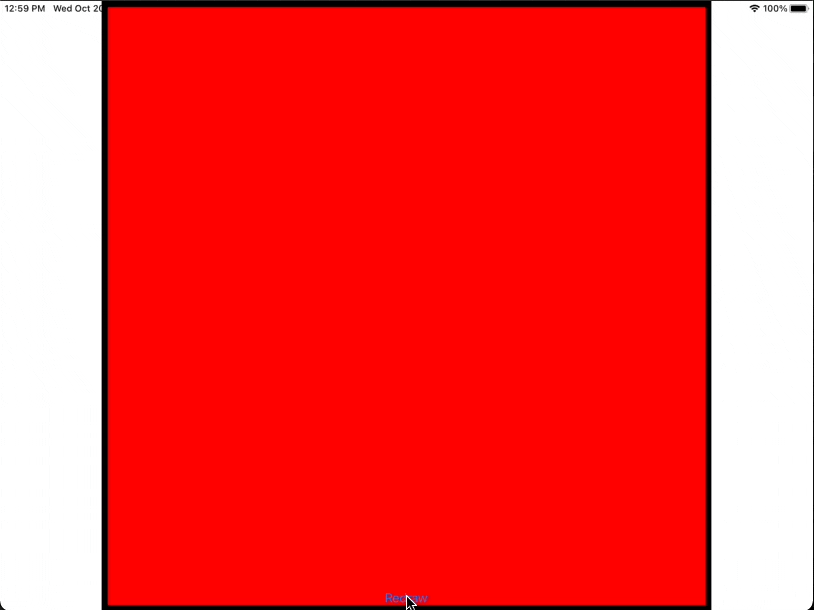

# 100-days-of-swift

### Logs

**Day 27:** Today i learned a little about Capture lists in swift, and undertood the difference between weak, unowned and strong references, what they mean and how to write safe code preventing crashed and memory leaks

**Day 28** Today i learned a little about comparing strings and checking if a word is real, is possible, or it's letters are contained in another word. I also learned that in Swift you cant compare 2 strings with the == operator, just like booleans and numbers

**Day 29** Today i made a challenge that made me fix the content i learned in the past 2 days. It was about dealing with strings, checking it's length, and presenting errors to the user. I also solve a bug that the app treated words in a case-sensitive way

**Day 30** Today i started learning about how to do Auto layout directly in code. I now know that i can create horizontal and vertical stacks using a String to represent my elements, like this: 
```swift
"V:|[label1]-[label2]-[label3]"
```
The - represents a 10pt spacing

**Day 32** Today i learned the difference between widthAnchor, heightAnchor, topAnchor, bottomAnchor, leftAnchor, rightAnchor, leadingAnchor, trailingAnchor, centerXAnchor, and centerYAnchor. TrailingAnchor and leadingAnchor will flip in right-to-left languages. I also learned that i can use multiples and adding constants to constraints based on my main View

**Day 33** Today i learned about the Codable protocol, which automatically can parse data from a JSON to Swift objects

**Day 34** Today i learned a little about how to use tabBars and how AppDelegate and SceneDelegate works

**Day 35** Today i learned how to filter info in an array, and how to resize tableViewCell to word wrap and look nicer when displaying data.

**Day 36** Today i learned how to make a view entirely from code, and i found it really hard at first. A little confusing, specially for someone who already saw how SwiftUI is and really liked it

**Day 37** Today i learned about dealing with a lot of buttons and appending text to a textLabel, and again loading content from a file but using more complex separators to get all data needed for the game

**Day 38** Today i made the chalenge to draw a gray line around a UIView, adjusting it width, and rounding it corners

**Day 39** Today i learned more about Grand Central Dispatch and de Quality of Service queues, the user Interactive with highest priority, User initiated , Utility queue, for long tasks that user doesn't need right now, and the background queue. There is the default queue, bet

**Day 40** Today it was a review day, and i could apply some things i learned about GCD in past projects

**Day 41** Today was a challenge and i've built a game from ground and it was really nice seeing i could use a lot of tools without looking back everytime. It isn't perfect but i'm happy that i was able to do it in 1 hour

**Day 42** Today i started learning about Collection View, and it's differences and similarities with TableView. It's really good to have so many tools already built-in in UIKit

**Day 43** Today i started learning about UIImagePicker and it's so easy to get images from users phone, and it even has a built-in crop image feature! Also learned more about Collection View and cells

**Day 44** Today i reviewed what i studied about CollectionView and UIImagePicker, and made some challenges. It was nice to revisit Project 1 and see that i could modify it with more confidence than in my first time

**Day 45** Today i learned about SpriteKit and starting creating a game. I've used the SKSpriteNode to create sprites and add it to screen with addChild. I also learned to add a physics body with SKPhyisicsBody

**Day 46** Today i learned more about SpriteKit and about colision between different objects, checking what to do depending on the object, add labels and detect if there is a label where the user is clicking, so it do a different code. And also, do something different based the coordinates of the touch location

**Day 47** Today i learned about SpriteKit Particles with SKEmitterNode, and also modified a fire particle. I also made a challenge and could understand better SpriteKit

**Day 48** Today i learned about how to store some data in disk with UserDefaults. it is mainly used to store small pieces of data like user preferences

**Day 49** Today i practiced more about UserDefaults, modifying some of my last projects to use it and have a better experience. I learned more about the difference between Codable and NSCoding, and how to convert JSON to load and save it with user defaults

**Day 50** Half of the Challenge done!! Today was a challenge and i needed to create a tableView showing a list of captions, and when selected, it shows a picture related to that caption. It was really good to understand better how present worked and how to make it prompt for user an AlertController and then an UIImagePicker

**Day 51** Today i watched two talks by Paul Hudson at different conferences, one talking about elements of functional programming in Swift and another about some subjects that new learners of Swift struggle. It was nice to review some concepts and learn a little more about things like map, flatMap and filter

**Day 52** Today i started project 13, creating an App to apply filter to pictures. It was most a wrap up and code that i already knew, but i learned a little about generating auto layout automatically and about Core Image concepts

**Day 53** Today i used CoreImage and applied some filters to pictures. I also used UIImageWriteToSavedPhotosAlbum to save the picture with filters

**Day 54** Today was the challenge to make my Photo filters app better, and i had a lot of difficulty trying to make something different with auto Layout and to know how to deal with Float and CGFloat, but i think it was good to struggle 2 days in this project because now i fell like i know how to solve more problems

**Day 55** Today i learned more about SpriteKit and how to animate penguins in a different game. It had a lot of randomness and i used asyncAfter to call functions after some delay indefinetly

**Day 56** Today was the first time i created my own particles and learned more about audio playing in SpriteKit. I think it is useful, but it has some bugs probably cause i didn't know exactly how to do properly all the animations, but it worked really good at the end

**Day 57** Today i learned more about animations with CoreAnimation, and how easy it is to make basic animations, with CoreAnimation handling everything between two states that i define. I can even reset the transformations using .identity

**Day 58** Today i applied CoreAnimations in past projects, and now i understand it a lot more. It makes animations without a lot of code and it's extremly powerful in personalization. I also used with ease-in ease-out and with spring animations

**Day 59** Today i made a challenge creating from scratch an App that loads a JSON file filled with countries info, and put it in a table view, presenting a detail view when you select it. It was good to review some concepts of loading from a file

**Day 60** Today i started using MapKit and understanding it protocols. I also created some annotations for Capitals, and created my own way of showing info in that annotations using Apple tools

**Day 61** Today i made a challenge of doing a webView showing after user clicking in an Annotation info button in map, and it was a really nice result and easy to do. I also played with different ways to show a Map

**Day 62** Today i started a new game in spriteKit, using Timers and physics to make it work

**Day 63** Today i made a challenge in this new project to make some adjustments, and i even made a restart label that was not needed, just because i felt it was missing it

**Day 64** Today i learned more about debugging, how to use assert, how to use breakpoints in xCode and how to view my views hierarchy when my app is running, so i can debug elements too

**Day 65** Today i applied what i learned in Day 64 in project 1 and project 5, using breakpoints, asserts and Exception breakpoints to debug forced errors in my apps

**Day 66** Today was a hard day, it took me more than one day to do it. I need to make from scratch a game of a shooting gallery, and it was a little hard. I needed to use a mix of concepts from the Spaceship game and the Penguins game, but after a lot of debugging that i learned in the last days, i finally made it work and liked the result. If i worked a little more in it, it would definetly be a good simple game to launch on AppStore

**Day 67** Today i started to create my own Safari extension, and it was cool to understand that iOS actually don't let extensions and safari exchange data directly, and act as a parser to make sure that anything suspicius won't hurt the user or get sensitive data

**Day 68** Today i finished the Safari extension, exhanging data between iOS and Javascript code, and handling keyboard input to show always above the Keyboard

**Day 69** Today i needed to do a challenge to complete the Safari extension trying to make it save in userDefaults the scripts that the person created for every website.

**Day 70** Today i started creating the Fireworks game with SpriteKit again, and how to create movement in different directions. It was quite simple, but it was just the first part

**Day 71** Today i finished doing challenges in the Fireworks game with SpriteKit, making the game stop after some time and the user restart it if he wants

**Day 72** Today i learned a little about notification, how to schedule it after user left my app, and how to deal with actions directly on the notification

**Day 73** Today i made some challenges and started to understand more of notifications. I know it changed a lot in iOS 15, so i already know that i still need to study a lot about the new notification system

**Day 74** Today was consolidation day, and i'm proud to announce that i made a lot of progress. I took the challenge of recreating a basic version of Apple Notes, and made it work with Core Data based on some past projects that i tried. It works really nice and i'm really happy with the results. Here you can see a gif:
<div style="align-items: center; display: flex; justify-content: center;">
    
</div>

**Day 75** Today i started using CoreLocation to locate Beacons, and change info in my app depending on how far the iPhone is from the Beacon. It was hard to test, because i don't have any Beacons nor more than one Apple device

**Day 76** I'm not quite sure it works, but i only have one device to test it, so maybe i'll get back there when i have another iDevice

**Day 77** Today i started making a version of Fruit Ninja, and i think it'll be pretty good. Right now the only thing that works are the swipe effects, but i hope it will be good when finished

**Day 78** Today i finished the game, and it's so fun. It's a lot of code, and maybe there is a good way to refactor it in different classes, but thats a challenge for the future. 

**Day 79** Today i made some chalenges on my Fruit Ninja game, creating a new type of enemy, a duck, refactoring code to use an Enum, and also learned about changing SKScenes to create a different GameOverScene, because the GameScene code was already really big, and i'm happy with the result

<div style="align-items: center; display: flex; justify-content: center;">
    
</div>

**Day 80** Today was a simple project, showing more about how to manipulate strings in Swift. I learned about NSAttributesString and NSMutableAttributedString and some of it's methods, and also how to create some extension methods to the String class

**Day 81** Today i made some challenges with strings, creating my own extension methods. It was nice to practice it's methods a little

**Day 82** Today i made a challenge to review some contents. I made an extension to UIView to execute a custom animation, in Int to have a custom method that receives a closure, and in Array with Comparable elements to remove an item from array receiving a element rather than an index

**Day 83** Today i made an App that connects with P2P and users can share photos. It didn't work exactly like the tutorial, and i found that the permissions to network access in iOS changed in newest versions, so i just updated following what i've found on internet and it worked!

**Day 84** Today was a challenge day and i made more buttons, one to send text instead of pictures, and another to list all connected users in the P2P connection

**Day 85** Today i started developing a labyrinth for iPad that will use the gyroscope. I only created the level and managed the sprites

**Day 86** Today i finished the game, working with the gyroscope to move the player, and also making some animations and working with collisions. I also learned about an if that the compiler do some changes depending on the running environment, running some code for the device, and a different one for the simulator, that doesn't have a gyroscope

**Day 87** Today i made some challenges to the Labyrinth game, and it was really fun to make a teleport node, playing with animations and positions. I also did some refactoring to make the code more readable. Here is how the app was in the end:

<div style="align-items: center; display: flex; justify-content: center;">
    
</div>

**Day 88** Today i started learning how to draw some figures using CoreGraphics and UIKit, here are the results:

<div style="align-items: center; display: flex; justify-content: center;">
    
</div>

**Day 89** Today i made some new shapes, it was really hard to mimic an emoji. They have so many complex shaped mixed up together

**Day 90** Today i made a challenge and created my own meme generator, and i learned a lot more about CoreGraphics when trying new things on how to render on different sizes of images

**Day 91** Today i made a Swift playgrounds of CoreGraphics, and i wish i had made this before the challenges. The thing is, now because i had a hard time with it, it's easier to remember 